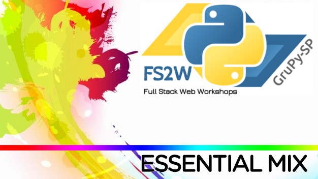
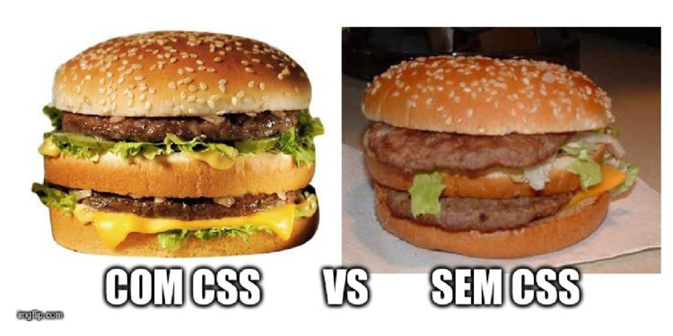

# FS2W



1. Introdução ao Linux
2. Introdução ao Git
3. HTML e CSS básico
4. Noções de JavaScript e jQuery
5. Introdução ao Vim
6. Lógica de Programação
7. Introdução ao Python
8. Introdução ao PostgreSQL


---

# Introdução ao Linux

```
CTRL + ALT + T
```

[Material do Rafael](https://speakerdeck.com/rafaelhenrique/linux-e-python)

```console
pwd
mkdir
ls
rm
cp
echo
cat
man
```

Grande portal [Shell Script 1 - O Básico](http://grandeportal.github.io/shell/2016/shell-script1/)


```bash
mkdir -p fs2w/essential_mix
tree fs2w
```

```bash
mkdir -p pasta/subpasta
rm -rf pasta/subpasta
```

**Cuidado** [com os comandos perigosos do Shell](http://grandeportal.github.io/shell/2016/cuidado-com-comandos-perigosos-do-shell/)!!!

```bash
cat << EOF > essential.txt
FS2W Essential Mix
EOF
cat essential.txt
```

Posso rodar?

```
source setup.sh
```


# Introdução ao Git

"Git não é GitHub"


Existem outros:

* [bitbucket.org](https://bitbucket.org/)
* [gitlab.com](https://about.gitlab.com/)

[Material do Samuka](https://github.com/samukasmk/git-brucelee/)

```
git clone <url>
git status
git add <arquivo>
git status
git commit -m <mensagem>
git push origin master
```

```
git pull
```

```
git checkout -b gh-pages
git add index.html
git commit -m "website v1"
git push origin gh-pages
```


# HTML e CSS básico

[Material do Amir](https://github.com/grupy-sp/encontros/blob/master/2017/fs2w/01-html-css.md)

Vários links:

[layoutit.com](http://www.layoutit.com/)

[startbootstrap.com](https://startbootstrap.com/template-categories/all/)

[pexels.com](https://www.pexels.com/)

Escolha um editor de texto e use o plugin [Emmet](https://emmet.io/).

## Head básico

```html
<!DOCTYPE html>
<html lang="en">
<head>
  <meta charset="UTF-8">
  <meta name="viewport" content="width=device-width, initial-scale=1.0">
  <link rel="shortcut icon" href="http://html5-training-in-hyderabad.blogspot.com.br/favicon.ico">
  <title>FS2W</title>
  <!-- Bootstrap core CSS -->
  <link rel="stylesheet" href="https://maxcdn.bootstrapcdn.com/bootstrap/3.3.7/css/bootstrap.min.css">
  <!-- Font-awesome -->
  <link rel="stylesheet" href="https://maxcdn.bootstrapcdn.com/font-awesome/4.7.0/css/font-awesome.min.css">
  <!-- jQuery -->
  <script src="https://code.jquery.com/jquery-3.2.1.min.js"></script>
  <!-- Bootstrap core JS -->
  <script src="https://maxcdn.bootstrapcdn.com/bootstrap/3.3.7/js/bootstrap.min.js"></script>
</head>
<body>
  
</body>
</html>
```

Meu exemplo:

#### ex1

```html
<body>
  <div>
     <div>
        <div>
           <form role="form">
              <div>
                 <label for="exampleInputEmail1">
                 Email address
                 </label>
                 <input type="email" id="exampleInputEmail1" />
              </div>
              <div>
                 <label for="exampleInputPassword1">
                 Password
                 </label>
                 <input type="password" id="exampleInputPassword1" />
              </div>
              <div>
                 <label for="exampleInputFile">
                 File input
                 </label>
                 <input type="file" id="exampleInputFile" />
                 <p>
                    Example block-level help text here.
                 </p>
              </div>
              <div>
                 <label>
                 <input type="checkbox" /> Check me out
                 </label>
              </div>
              <div>
                <select>
                  <option value="1">Um</option>
                  <option value="2">Dois</option>
                  <option value="3">Três</option>
                  <option value="4">Quatro</option>
                  <option value="5">Cinco</option>
                </select>
              </div>
              <div>
                <label>
                  <input type="checkbox" id="inlineCheckbox1" value="option1"> Um
                </label>
                <label>
                  <input type="checkbox" id="inlineCheckbox2" value="option2"> Dois
                </label>
                <label>
                  <input type="checkbox" id="inlineCheckbox3" value="option3"> Três
                </label>
              </div>
              <div>
                <label>
                  <input type="radio" name="inlineRadioOptions" id="inlineRadio1" value="option1"> Um
                </label>
                <label>
                  <input type="radio" name="inlineRadioOptions" id="inlineRadio2" value="option2"> Dois
                </label>
                <label>
                  <input type="radio" name="inlineRadioOptions" id="inlineRadio3" value="option3"> Três
                </label>
              </div>
              <button type="submit">Submit</button>
           </form>
        </div>
     </div>
  </div>
```

## CSS




[Bootstrap](http://getbootstrap.com/)


#### ex2

layoutit.com

```html
<body>

  <div class="container-fluid">
     <div class="row">
        <div class="col-md-12">
           <form role="form">
              <div class="form-group">
                 <label for="exampleInputEmail1">
                 Email address
                 </label>
                 <input type="email" class="form-control" id="exampleInputEmail1" />
              </div>
              <div class="form-group">
                 <label for="exampleInputPassword1">
                 Password
                 </label>
                 <input type="password" class="form-control" id="exampleInputPassword1" />
              </div>
              <div class="form-group">
                 <label for="exampleInputFile">
                 File input
                 </label>
                 <input type="file" id="exampleInputFile" />
                 <p class="help-block">
                    Example block-level help text here.
                 </p>
              </div>
              <div class="checkbox">
                 <label>
                 <input type="checkbox" /> Check me out
                 </label>
              </div>
              <div class="form-group">
                <select class="form-control">
                  <option value="1">Um</option>
                  <option value="2">Dois</option>
                  <option value="3">Três</option>
                  <option value="4">Quatro</option>
                  <option value="5">Cinco</option>
                </select>
              </div>
              <div class="form-group">
                <label class="checkbox">
                  <input type="checkbox" id="inlineCheckbox1" value="option1"> Um
                </label>
                <label class="checkbox">
                  <input type="checkbox" id="inlineCheckbox2" value="option2"> Dois
                </label>
                <label class="checkbox">
                  <input type="checkbox" id="inlineCheckbox3" value="option3"> Três
                </label>
              </div>
              <div class="form-group">
                <label class="radio">
                  <input type="radio" name="inlineRadioOptions" id="inlineRadio1" value="option1"> Um
                </label>
                <label class="radio">
                  <input type="radio" name="inlineRadioOptions" id="inlineRadio2" value="option2"> Dois
                </label>
                <label class="radio">
                  <input type="radio" name="inlineRadioOptions" id="inlineRadio3" value="option3"> Três
                </label>
              </div>
              <button type="submit" class="btn btn-primary">Submit</button>
           </form>
        </div>
     </div>
  </div>
```


# Noções de JavaScript e jQuery

[Material da Camila](https://goo.gl/EGXZ58)


[jsfiddle.net](https://jsfiddle.net/)

```js
var name = 'Regis';
let car = {color: 'blue'};
console.log(name);
console.log(car);
```

```js
for (let i = 0; i <= 10; i++) {
  console.log(i);
}
```

```js
var i = 1;                     //  set your counter to 1

function myLoop () {           //  create a loop function
   setTimeout(function () {    //  call a 3s setTimeout when the loop is called
      console.log(i);          //  your code here
      i++;                     //  increment the counter
      if (i <= 10) {            //  if the counter < 10, call the loop function
         myLoop();             //  ..  again which will trigger another 
      }                        //  ..  setTimeout()
   }, 500)
}

myLoop();
```

Eventos

jQuery

### Rodar servidor

```
python3 -m http.server 8080
```
Entrar em http://localhost:8080/spa.html

```html
<!-- spa.html -->
<!DOCTYPE html>
<html lang="en">
<head>
  <meta charset="UTF-8">
  <meta name="viewport" content="width=device-width, initial-scale=1.0">
  <link rel="shortcut icon" href="http://html5-training-in-hyderabad.blogspot.com.br/favicon.ico">
  <title>FS2W</title>
  <!-- Bootstrap core CSS -->
  <link rel="stylesheet" href="https://maxcdn.bootstrapcdn.com/bootstrap/3.3.7/css/bootstrap.min.css">
  <!-- Font-awesome -->
  <link rel="stylesheet" href="https://maxcdn.bootstrapcdn.com/font-awesome/4.7.0/css/font-awesome.min.css">
  <!-- jQuery -->
  <script src="https://code.jquery.com/jquery-3.2.1.min.js"></script>
  <!-- Bootstrap core JS -->
  <script src="https://maxcdn.bootstrapcdn.com/bootstrap/3.3.7/js/bootstrap.min.js"></script>

  <style>
    .starter-template {
      padding: 0 15px;
      text-align: center;
    }
    #add_contact {
      margin-bottom: 10px;
    }
    #edit_contact {
      color: #0066FF;
      cursor: pointer;
    }
    #delete_contact {
      color: #d9534f;
      cursor: pointer;
      margin-left: 10px;
    }
  </style>
</head>
<body>

  <div class="starter-template">
    <h1>FS2W Essential Mix</h1>
  </div>
  <hr>
  <div class="col-sm-4 col-sm-offset-4">
    <button id="add_contact" class="btn btn-primary" data-target="#add_contact_modal" data-toggle="modal">
      <i class="fa fa-plus"></i> Contato
    </button>
    <div id="list_contact" class="list-group">
        <!-- Lista -->
        <div id="item_" class="list-group-item">
          <span id="delete_contact" class="js-delete-contact pull-right" data-target="#del_contact_modal" data-toggle="modal"><i class="fa fa-lg fa-times"></i></span>
          <span id="edit_contact" class="js-edit-contact pull-right" data-target="#edit_contact_modal" data-toggle="modal"><i class="fa fa-lg fa-pencil-square-o"></i></span>
          <p><b>Nome:</b> contact</p>
          <p><b>e-mail:</b> contact.email</p>
        </div>

    </div>
  </div>

  <script>
    $(document).ready(function() {
      $.getJSON('names.json', function(data) {
        for (var i = 0; i < data.length; i++) {
          console.log(data[i]);
        }
      });
    });
  </script>
</body>
</html>
```

#### ex3

Populando a página com os dados do json

```json
[
    {
        "name": "Regis Santos",
        "e-mail": "regis@example.com"
    },
    {
        "name": "Rafael Henrique",
        "e-mail": "rafael@example.com"
    },
    {
        "name": "Isabel Silva",
        "e-mail": "isabel@example.com"
    }
]
```

#### ex4

```js
<script>
  $(document).ready(function() {
    $.getJSON('names.json', function(data) {
      if (data.length == 0) {
        $('#list_contact').append(
          '<p class="lead alert alert-warning">Não existem itens na lista.</p>'
        );
      } else {
        for (var i = 0; i < data.length; i++) {
          $('#list_contact').append(
            '<div class="list-group-item">' +
            '<span class="js-delete-contact pull-right"><i class="fa fa-lg fa-times"></i></span>' +
            '<p><b>Nome:</b> ' + data[i]['name'] + '</p>' +
            '<p><b>e-mail:</b> ' + data[i]['e-mail'] + '</p>' +
            '</div>'
          );
        }
      }
    });
  });
</script>
```

## Modal

#### ex5

```html
<!-- Add Contact Modal -->
<div class="modal fade" id="add_contact_modal" aria-labelledby="addContactModalLabel" aria-hidden="true">
    <div class="modal-dialog">
        <div class="modal-content">
            <div class="modal-header">
                 
                <button id="dismiss_contact_close" type="button" class="close" data-dismiss="modal" aria-hidden="true">x</button>
                <h4 class="modal-title" id="addContactModalLabel">
                    Novo Contato
                </h4>
            </div>
            <form id="add_contact_form" action="." method="POST">
              <div class="modal-body">
                <div class="form-group">
                  <label class="control-label" for="id_name">Nome</label>
                  <input type="text" name="name" id="id_name" class="form-control" />
                </div>
                <div class="form-group">
                  <label class="control-label" for="id_email">E-mail</label>
                  <input type="email" name="email" id="id_email" class="form-control" />
                </div>
              </div>
              <div class="modal-footer">
                   
                  <button type="button" class="btn btn-default" data-dismiss="modal">Cancelar</button>
                  <button type="submit" class="btn btn-primary">Salvar</button>
              </div>
            </form>
        </div> <!-- modal-content -->
        
    </div> <!-- modal-dialog -->
    
</div> <!-- end modal -->
```

#### ex6

Preenchendo o form e populando o HTML

```html
$('#add_contact_form').on('submit', function(e) {
  e.preventDefault();
  add_contact_post();
});

function add_contact_post() {
  // Pega os valores dos campos name e email
  let name = $('#id_name').val();
  let email = $('#id_email').val();
  // Remove os valores dos inputs
  $('#add_contact_form')[0].reset();
  // Fecha o form
  $('#dismiss_contact_close').click();
  // Adiciona o novo contato na lista
  $('#list_contact').prepend(
    '<div class="list-group-item">' +
    '<span id="delete_contact" class="js-delete-contact pull-right"' + '" data-target="#del_contact_modal" data-toggle="modal"><i class="fa fa-lg fa-times"></i></span>' +
    '<span id="edit_contact" class="pull-right"><i class="fa fa-lg fa-pencil-square-o"></i></span>' +
    '<p><b>Nome:</b> ' + name + '</p>' +
    '<p><b>e-mail:</b> ' + email + '</p>' +
    '</div>'
  )
}
```

Deletando os itens

Errado!

```js
$('.js-delete-contact').click(function(e) {
  e.preventDefault();
  console.log('teste');
});
```

https://stackoverflow.com/a/12055498

```js
$(document).on('click', '.js-delete-contact', function(e) {
  e.preventDefault();
  $(this).parent().remove();
});
```

Não terminou, precisa continuar...


# Introdução ao Vim

Não tem material :(

[Grupylango - Vim - mais que um editor - com Magun Leno](https://www.youtube.com/watch?v=UUzW46SeLhg)

[Grande Portal - Vim](http://grandeportal.github.io/editor%20de%20texto/2017/vim/)


# Lógica de Programação

[Material do Paulo Romano](https://github.com/grupy-sp/encontros/blob/master/2017/fs2w/06-logica.md)


# Introdução ao Python


[Material das PyLadies](https://github.com/rg3915/fs2w/blob/master/material/Grupy_PLSP_Interm_v2.pdf)

```python
names = ('Regis Rafael Samuel Amir Camila Juliano').split()
names
```

### Nota final de provas

```python
import unittest


def nota(valor):
    if valor >= 7:
        return 'Aprovado'
    elif valor >= 4:
        return 'Recuperação'
    else:
        return 'Reprovado'


class GradeTest(unittest.TestCase):

    def test_grade(self):
        self.assertEqual(nota(10), 'Aprovado')
        self.assertEqual(nota(7), 'Aprovado')
        self.assertEqual(nota(6.9), 'Recuperação')
        self.assertEqual(nota(4), 'Recuperação')
        self.assertEqual(nota(3.9), 'Reprovado')
        self.assertEqual(nota(0), 'Reprovado')


def main():
    alunos = {
        'Regis': 1,
        'Renata': 10,
        'Samanta': 10,
        'Karina': 6.9,
        'João': 4,
        'Pedrinho': 0,
    }
    for aluno, valor in alunos.items():
        print(aluno, valor, nota(valor))

if __name__ == '__main__':
    main()
    unittest.main()
```

# Introdução ao PostgreSQL

[Material do Juliano](https://github.com/juliano777/pgsql_fs2w)

[Gerenciando Sqlite3 com Python](http://pythonclub.com.br/gerenciando-banco-dados-sqlite3-python-parte1.html)

```sql
CREATE TABLE tb_person(
    id INTEGER PRIMARY KEY AUTOINCREMENT,
    name varchar(50),
    email varchar(50)
);
```

```sql
INSERT INTO tb_person(name, email) VALUES ('Regis', 'regis@email.com');
```

```sql
INSERT INTO tb_person(name, email) VALUES
('Rafael', 'rafael@email.com'),
('Camila', 'camila@email.com'),
('Juliano', 'juliano@email.com');
```

```sql
SELECT * FROM tb_person;
```

---

## Avisos

### 12/08/17 GruPy-SP Day Locaweb


### 15/08/17 Coding Dojo na Purple99


### 19/08/17 FS2W #10 Flask Mackenzie


