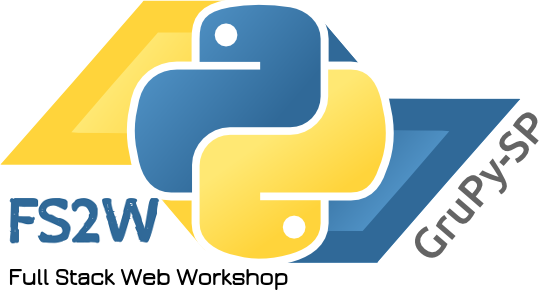

# Full Stack Web Workshop GruPy-SP

## HTML e CSS básico

**Data:** xx/01/17

**Lugar:** xx

**Instrutor:** xx

**Duração:** xx horas

**Descrição curta:**

Introdução a HTML e CSS. Com este workshop você será capaz de criar sua própria landpage e tornar seu projeto apresentável para seu cliente.

**Descrição longa:**

Introdução a HTML e CSS. Com este workshop você será capaz de criar sua própria landpage e tornar seu projeto apresentável para seu cliente.

Além disso veremos um pouco de Bootstrap para tornar seu site responsivo e muito mais bonito.

Se der tempo vamos colocar nosso site no ar usando o GitHub Pages.

**Objetivo:**

* Entender o que é HTML e manipular o DOM.
* Conhecer alguns comandos CSS.
* Criar uma landpage com Bootstrap.

**Chamada para o evento:**

Crie sua landpage nesse workshop de HTML e CSS e torne seu projeto apresentável para seu cliente.

http://line25.com/articles/free-html-templates-high-impact

